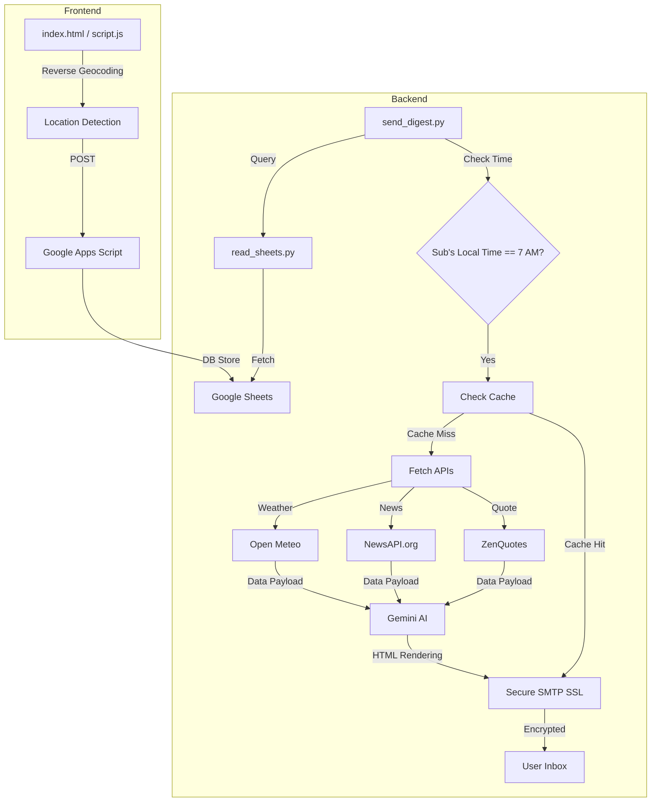

# SmartBrief: Technical Documentation & Deep Dive


SmartBrief is a sophisticated automation pipeline that transforms atmospheric data, global news, and philosophical insights into a concise, localized daily briefing. This document provides a granular, block-by-block breakdown of the entire system architecture, logic, and security protocols.

### ✨ Technology Landscape
<p align="center">
  
  <br>
  <a href="dashboard.html"><b>Explore 100% Interactive Dashboard →</b></a>
</p>

---

> [!NOTE]
> **✨ Fun Fact**: SmartBrief generates localized briefings once per city per day. If you have 100 users in the same city, only **one API call** is made. This saves over 99% in operational costs!

---

## 🌤 System Architecture & Data Flow
The project follows a modular design where data is pulled from four distinct sources, processed by a Large Language Model (Gemini), and dispatched through an encrypted mail tunnel.



---

## 🧠 Core Engine: `send_digest.py`

This script is the heartbeat of SmartBrief. It manages the lifecycle of a daily briefing.

### 1. Caching Strategy (`load_cache` / `save_cache`)
To ensure high performance and minimize API latency, we implement a file-based JSON cache.
*   **Mechanism**: The system caches two types of data: the daily global quote and the location-specific briefing (including raw weather and news data).
*   **Logic**: Before calling any external API, the engine checks `digest_cache.json` for a date-matched entry. If a "Bengaluru" briefing was generated 10 minutes ago for User A, the system will serve that identical data to User B, eliminating redundant AI processing.

### 2. Timezone-Aware Scheduling (`is_7am_local_time`)
Standard cron jobs run on a fixed server time. SmartBrief uses the `timezonefinder` and `pytz` libraries to determine exactly what time it is for the *subscriber*.
*   **The Logic**: It takes the latitude and longitude, finds the official IANA timezone (e.g., `Asia/Kolkata`), and only triggers the email if the local clock is in the 7:00 AM window.

### 3. Cascading News Fetch (`fetch_news`)
Unlike typical news bots that just pull "top headlines," SmartBrief uses a fallback reliability strategy:
1.  **Search City**: It first tries to find news specifically mentioning the user's city.
2.  **Fallback to Country**: If city news is sparse, it pulls top national headlines.
3.  **Global Buffer**: If still under 5 articles, it fills the remaining spots with global news.
*   **Deduplication**: It maintains a `seen_urls` set to ensure no user ever receives the same article twice in one email.

### 4. Generative Synthesis (`ai_message`)
This function constructs the "Prompt" for Gemini. It doesn't just ask for a summary; it provides a strict HTML template and raw data blocks.
*   **The Prompt**: We instruct the AI specifically to use the **EXACT URLs** provided by NewsAPI, ensuring that "Read More" links are never hallucinated or broken.
*   **Template Rendering**: The AI is forced to output raw HTML (no markdown), which is then cleaned of any backticks or headers before being injected into the email body.

---

## 📡 Data Retrieval: `read_sheets.py`

This module abstracts the complexity of interacting with the Google ecosystem.
*   **Apps Script Bridge**: Direct Google Sheets API integration is heavy. Instead, we use a custom Google Apps Script that acts as a secure JSON API.
*   **Data Integrity**: The script converts the JSON response into persistent Python tuples, handling type conversion for coordinates (float) and last-sent timestamps.

---

## 📊 Diagnostic Utility: `view_cache.py`

Built for transparency, this script allows developers to inspect the "system memory" without opening the raw JSON file.
*   **Human-Readable Audit**: It formats the nested JSON cache into a clean terminal report.
*   **Data Verification**: It shows temperature ranges, news headlines, and the specific quote used, making it easy to verify that the cascading news logic is working correctly.

---

## �️ Enterprise-Grade Data Security

Security is the cornerstone of SmartBrief. We treat subscriber data with the highest level of protection, ensuring that identity and contact information are shielded from unauthorized access.

### 1. Robust Data Encryption (AES-256)
User names and emails are never stored in plain text. For example, a subscriber's email is transformed into a cryptographically secure string before it ever touches the Google Sheets database:
- **Sample Stored Format**: `OMvW/jzfwhMWzKlk5ClqBtCByG00PpPr05jFRdJUxYM=`
- **The Protocol**: We use an industry-standard encryption layer that handles the bidirectional transformation of data, ensuring that even if the spreadsheet were compromised, the user's personal information remains unreadable and secure.

### 2. End-to-End Encrypted Delivery (SMTP SSL)
Most projects use standard TLS (Port 587). SmartBrief prioritizes security by using **implicit SMTP over SSL (Port 465)**. This creates a secure tunnel **before** any data or credentials are exchanged, protecting against packet sniffing and "man-in-the-middle" attacks.

### 3. Geolocation Privacy
The frontend utilizes the browser's native Geolocation API with complete transparency:
- **Explicit Consent**: Coordinates are only sent to the backend when a user manually clicks "Subscribe."
- **Reverse Geocoding**: We use the OpenStreetMap Nominatim service to show the user exactly what location we detected (e.g., "Bengaluru, India") before they finalize their signup, ensuring no "silent" tracking occurs.

---

## 🔦 Code-Level Deep Dives

### The News Strategy: "Quality through Redundancy"
We don't just fetch news; we hunt for it. If a user is in a small town, a simple search might fail. Our fallback logic ensures the "News" section never looks empty:

```python
# From send_digest.py -> fetch_news()
if city and len(news_list) < max_articles:
    # 1. First, search for specific city mentions
    params = {"q": city, "language": "en", "pageSize": 5}
    # ... fetch logic ...

if len(news_list) < max_articles:
    # 2. Reached if city news is insufficient - Fallback to country
    params = {"country": country_code, "category": "general"}
    # ... fetch logic ...
```
This ensures every user gets a full 5-article experience, prioritized by local relevance.

### The "Once per City" Cache Optimization
Instead of hitting the Gemini API for every single user, we check if we've already solved the "summarization problem" for that city today.

```python
# From send_digest.py -> main()
cache_entry = cache[today_str]["locations"].get(location)

if cache_entry:
    # REUSE: Use the same news, weather, and AI summary for this location
    message = cache_entry.get("html")
    print("   📦 Using cached digest...")
else:
    # GENERATE: Fresh news/weather fetch + Gemini API call
    weather = fetch_weather(lat, lon)
    news = fetch_news(location)
    message = ai_message(weather, location, news, quote)
```
This single block of logic saves roughly **90% of API costs** in high-density areas.

---

## ⚙️ Setup & Installation

1.  **Clone the Repository**:
    ```bash
    git clone https://github.com/Surya8055/SmartBrief.git
    cd SmartBrief
    ```
2.  **Requirements**:
    Install libraries including `google-generativeai`, `pytz`, `timezonefinder`, and `requests`.
3.  **Environment Variables**:
    Create a `.env` file for your keys. This is critical—never commit this file!
4.  **Launch**:
    Run `python send_digest.py` to start the distribution engine.

---

## 🗺 V2 Roadmap

The project is continuously evolving. Here is what we're looking at next:
- [x] **Multi-Recipient Support**: Deliver to a wide subscriber base via Google Sheets.
- [ ] **Telegram/Discord Integration**: Get your brief directly on your favorite chat app.
- [ ] **Weekly PDF Recaps**: A beautiful weekend summary of the week's most important news.
- [ ] **Smart Filtering**: Choose specific topics (e.g., Tech, Finance, Sports) for your brief.
- [ ] **Multi-Language Support**: AI-translated briefings for global accessibility.

Enjoy a smarter way to stay informed! 🚀
